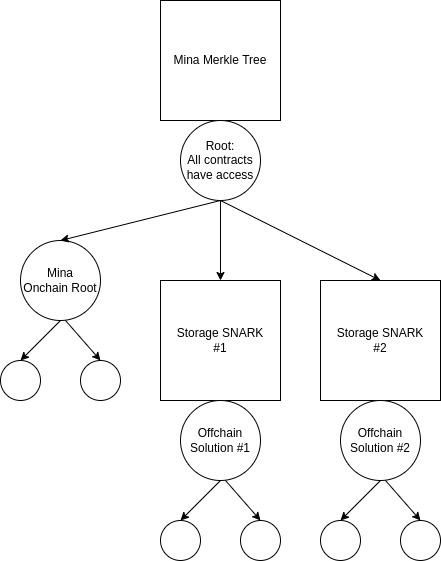

# Mina Snapp: Merkle Test

This template uses TypeScript.

## How to build

```sh
npm run build
```

## How to run tests

```sh
npm run test
npm run testw # watch mode
```

## How to run coverage

```sh
npm run coverage
```

## License

[Apache-2.0](LICENSE)

# Meeting Notes

### Merkle tree with IPFS and OrbitDB for key value store

I made a simple Mechanisms for committing the merkle root of an OrbitDB keyvaule store to chain and checking inclusion proofs.

##### Questions/Key Points

* Is bit-wise XOR efficient in Mina? Is there any alternative for making proofs that don't require a position vector? Is a bunch of if a bad idea?
* Would somebody be willing to walk me through the process for adding new stuff to the SnarkJS? Is it better to just make it it's own library? Is there an example of a SnarkyJS library? Are there plans to support interaction between contracts?
* IPFS seems pretty DDoSable in general. Especially when it comes to updating IPNS entries.
* Are we going for MVP or something permanent here. It seems like the distance between something that works today and something that makes sense long term could be pretty significant.

### Native IPFS proofs

I believe it's possible to extend IPFS to use the Poseidon hash function! Then it should be possible to create proofs for Poseidon IPFS blocks directly. I don't know exactly what this would look like! I imagine reading state would be simple, but writing state would involve changing one of the blocks on IPFS and updating the onchain root. I haven't found and easy way to do change just one IPFS block yet. IPFS MFS makes it easy to do this at the file level, but implementing all of the MFS stuff in a snark might be too complicated. It's possible to just recreate the whole database from the ground up every time, but it seems like there should be a way to structure the data in IPFS instead of just committing it into a block.

##### Questions/Key Points
* Are there plans to support SHA?
* This would be a more general thing that I had originally imagined. It might be a lot more work, but it also might open the door to unique possibilities, and stay useful even if it doesn't become the primary offchain storage solution.

### Mina Validium



##### Questions/Key Points

* Would someone who knows more about everything be willing to talk with me more about this?
* Is there any plan for how sequencers will work yet?
